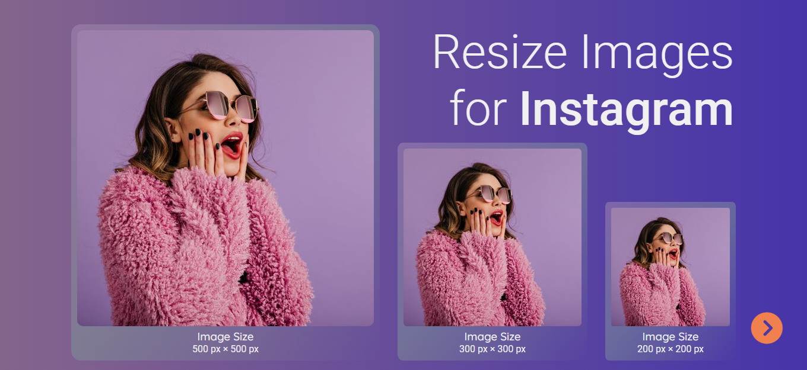

# NodeJS Image Processing API Express Sharp
- This project is about building an API that can be used as a library to serve properly scaled versions of the uploaded image.
 Rather than needing to resize and upload multiple copies of the same image to be used throughout your site, the API handle resizing and serving stored images for you.
- Using the solution of fetch and modern promises, I developed an async js web app that uses the uploaded images and my image processing API to dynamically update the UI for the BROMO web app.
# Demo Preview



# Technologies / Tools  
- Typescript
- Express JS
- Jasmine
- Prettier
- Es-lint 
- Sharp
- Multer

# Scripts
- Install all dependencies: ```npm install```
***(This command will install all dependencies I've used for the project and save them in the ./node_modules folder)***
- Build: ```npm run build```
***(This command will build the typeScript code into JS and save them in the ./dist folder)***
- Start server: ```npm run dev```
# Usage
- The server will listen on port 3000 ```http://localhost:3000/```
- Upload any image (.png / .jpeg / .jpg) to resize it to (500px × 500px) & (300px × 300px) & (200px × 200px) 


# Learn how to build a Nodejs API and how I have developed this Image Processing Web APP
## 1. Set up the server and configure typeScript
- Initialize ```package.json``` :
    ```bash
        npm init
    ```
- Install typeScript to dev Dependencies :  
    ```bash
        npm i --save-dev  typescript
    ```
- Initialize ```tsconfig.json``` : 
    ```bash 
        ./node_modules/.bin/tsc --init
    ```
- Install nodemon and node-ts to watch the ts,json files changes and start the server : 
    ```bash
        npm i nodemon node-ts --save-dev 
    ```
- Write scripts in package.json for nodemon library (dev), compile typeScript code into JS (build) and run the server (start)
    ```json
        "scripts": {
            "dev": "nodemon src/index.ts",
            "build": "tsc",
            "start": "npm run build && node dist/index.js"
        }
    ```
- Install Es-lint + Prettier and configure them
    ```bash
        npm i --save-dev prettier  
        npm i --save-dev eslint  
        npx eslint --init
        npm i eslint-config-prettier eslint-plugin-prettier --save-dev 
    ```
- Write scripts in package.json for formatting and linting
    ```json
        "scripts": {
            "format": "prettier --write src/**/*.ts",
            "lint": "eslint src/**/*.ts",
            "lint:fix": "eslint src/**/*.ts --fix"
        }
    ```
- Install Express for starting the server :
    ```bash
        npm i express
        npm i @types/express --save-dev
    ```

## 2. Resize the uploaded images
1. Client side :
- In index.html, add enctype to your form


- In app.js, after validating  the form, send a POST request to the server to store the uploaded image.


2. Server side :
- Install Multer middleware to process files uploaded in multipart/form-data format. :
    ```bash
        npm i multer
        npm i @types/multer --save-dev
    ```
- Use multer storage to store the uploaded images there before handling the POST request in the POST router 

- Install Sharp to resize the uploaded images
    ```bash
        npm i sharp
        npm i @types/sharp --save-dev
    ```
- Use sharp to resize the uploaded image using it's buffer

- Send GET request to the server to retrieve the stored data from the server and dynamically update the UI of the web app.

# API Routes
    ```bash
        .post('/resizedImages', uploads.single('thumbnail'), controller.create);
        .get('/resizedImages/500_500', controller.get_500_500);
        .get('/resizedImages/300_300', controller.get_300_300);
        .get('/resizedImages/200_200', controller.get_200_200);
    ```


# Endpoints
http://localhost:3000/api/resizedImages/500_500
http://localhost:3000/api/resizedImages/300_300
http://localhost:3000/api/resizedImages/200_200

# Unit Testing
```npm run test```

```json
    "scripts": {
        "test": "npm run build && jasmine"
    }
```


# Table of contents
- [Project Title](#nodejs-image-processing-api-express-sharp)
- [Demo Preview](#demo-preview)
- [Scripts](#scripts)
- [Usage](#usage)
- [Steps to build a Nodejs API](#learn-how-to-build-a-nodejs-api-and-how-i-have-developed-this-image-processing-web-app)
- [API Routes](#api-routes)
- [Endpoints](#endpoints)
- [Unit Testing](#unit-testing)
- [Table of contents](#table-of-contents)
